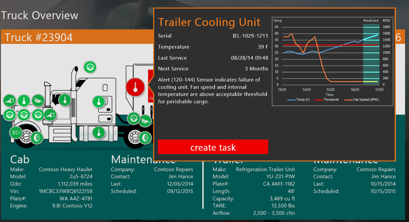
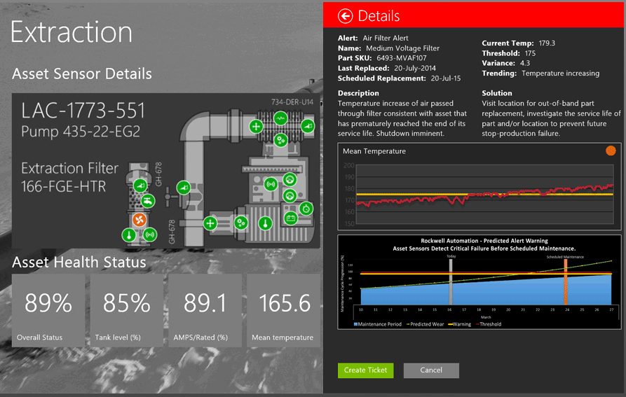

% IoT y machine learning en Azure
% Miguel Sánchez de León Peque
% 2017-06-02

# IoT

## What is it?

> **Internetworking** of devices **collecting** and **exchanging** data

{width=40%}

---

## How does it look like?

> Internet

. . .

> Things Things Things Things Things Things Things Things Things Things Things Things Things Things Things Things Things Things Things Things Things Things Things Things Things Things Things Things

## How many?

Billions in the following years (tens of billions by 2020)

- Data producers

# Azure

## Integrated solution

- Infraestructure
- Scalability
- Availability
- Real-time data processing
- Real-time visualizations (graphs, maps)
- Alerts
- Predictions
- Security

---

## Advantages

- State synchronization
- Per-device authentication
- Route device-to-cloud messages to Azure services
- Monitoring
- Protocols: MQTT, HTTP, AMQP
- Scale

# Example: fleet management

---

## Operations map

- Assets tracked/monitored in real-time
- Health status and trip/destination information
- Alerts escalated for attention for immediate action

---

## Alerts

- Displayed as a list
- Easily filter by severity or any other metric
- Categories: maintenance, weather, predictive...
- Click to take action

---

## Asset status

- Real-time sensor and device data
- Click for current reading and historical information

---

## Asset data

- Current reading
- Compare to historical data
- Warning thresholds
- Predicted readings

---

## Alert resolution

- Details about the alert
- Details about the failing part
- Business impact information
- Take action

---

---

# Example: rockwell automation

---

---

---

# Cognitive Services APIs

## What are Cognitive Services?

- REST based API
- The language you like
- The tools you like

## Types

- Vision
- Knowledge
- Speech
- Language
- Search

## Vision

- Computer vision
- Content moderator
- Emotion
- Face
- Video

---

### Example

Uber

## Speech

- Bing speech
- Custom speech service
- Speaker recognition

## Language

- Bing spell check
- Language understanding
- Linguistic Analysis
- Text Analysis
- Translator
- WebLM

## Knowledge

- Academic
- Entity linking
- Knowledge exploration
- QnA maker
- Recommendations

## Search (Bing)

- Autosuggest
- Image
- News
- Video
- Web

## Fun!

# Machine Learning

## The line equation

A simple equation:

$$y = x + 5$$

Ease to calculate $y$ for different values of $x$.

---

## The inverse problem

We do not have the equation:

$$y = h(x) ?$$

---

---

## What is machine learning?

It is a way to make sense of the data (which can be interpreted in different ways).

---

---

---

## The trade-off

- Bias vs. variance
- Abstraction vs. specificity
- Underfit vs. overfit

# Linear Regression

## Model

$$h = w_0 + w_1 x_1 + w_2 x_2 + ... + w_D x_D$$

- Simple
- Closed-form solution ($D\downarrow$)
- $\nabla RSS$ easily computable

## Example

How much time does an object take to free-fall down to the floor?

$t \approx 0.451754 h^{-1/2}$

---

## Meet Azure Machine Learning Studio

---

- Upload a dataset
- Visualizing a dataset
- Opening a dataset with a notebook
- Descriptive statistics

---

- Split data
- Train model (linear regression)
- Score model
- Evaluate model

---

- Publish model as a service
